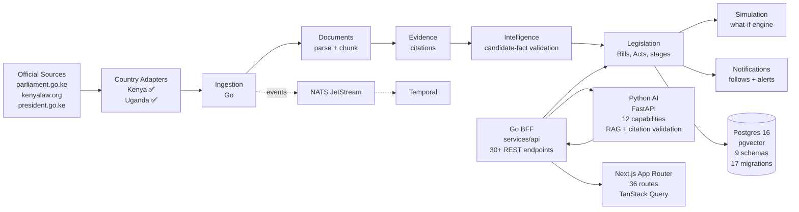
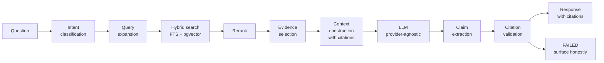
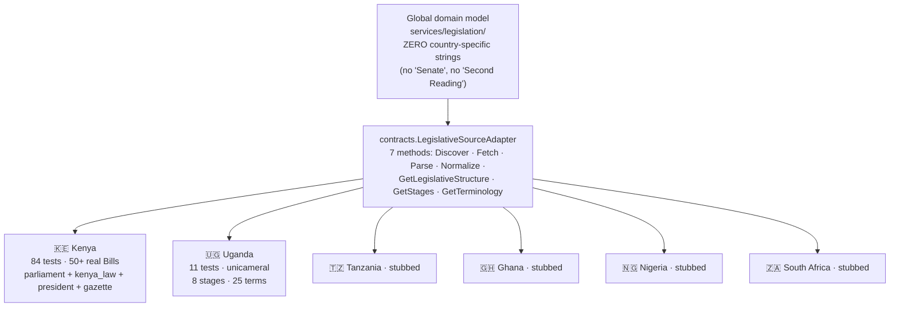

# Building Civic Intelligence with Next.js + AI

> Slides for droidcon Uganda 2026 — Session, 30 minutes
> Speaker: Roy Wanyoike · github.com/Roy-Wanyoike/civic-intelligence

These are the Markdown source slides. The HTML version (`slides.html`) is the canonical, presentable version — it renders via reveal.js 5 from CDN with mermaid.js diagrams, highlight.js code highlighting, and speaker notes embedded as `<aside class="notes">`.

---

## Slide 1 — Title

```
Building Civic Intelligence with
Next.js + AI

Lessons from Kenya's Parliament

Roy Wanyoike
droidcon Uganda 2026 · October 28–29, Kampala
github.com/Roy-Wanyoike/civic-intelligence
```

*Notes: 30 seconds. Don't read the title. Introduce yourself. Move on.*

---

## Slide 2 — The problem

```
Citizens can't follow what Parliament is doing.

- 50+ live Bills on kenyalaw.org at any moment
- 80-page Bill texts in legalese
- Two chambers (NA + Senate) publishing their own Hansard
- Gazette notices, Order Papers, committee reports, assent RSS
- By the time a Bill becomes an Act, even keen followers lose the thread

The information is technically public.
It is almost impossible to read.

That gap — between "public" and "accessible" — is where the harm happens.
```

*Notes: 2 minutes. Stop on the last bullet. Let it land.*

---

## Slide 3 — The opportunity

```
The sources are out there.

parliament.go.ke · kenyalaw.org · president.go.ke
HTML · PDF · RSS — ugly, structured enough to scrape.

What if every authoritative source is a first-class citizen,
every claim is grounded in one of them,
and AI does the explaining — not the deciding?

Show people what happened.
Explain what it means.
Show them the evidence.
Let them decide what to think.

Not a political platform. Not affiliated with the Government of Kenya.
A civic-information project.
```

*Notes: 1.5 minutes. Mission slide. Don't linger.*

---

## Slide 4 — Architecture overview



**Key boundaries:**
- Go + Python side by side. The LLM is behind a gateway, not in the frontend.
- Every request goes through `ModelGateway.complete()` — budgets, retries, fallback, capability-based routing.
- 5 deployables, not 15. Modular monolith + workers (ADR-0001).

*Notes: 3 minutes. The densest slide. Point at each box. Don't read the bullet list aloud.*

---

## Slide 5 — Evidence-first AI: the pipeline



**Citation validator — 5 checks per claim:**
1. Does the cited source exist?
2. Does the citation point to the correct document?
3. Does the snippet share at least one significant word with the claim?
4. Is the claim stronger than the evidence?
5. Is the source authoritative?

If validation fails → response is marked `validation_status = FAILED` and surfaced as `[This response could not be fully verified from available authoritative sources.]`

Under-claiming is the feature, not the bug.

*Notes: 3 minutes. Point at each pipeline stage. Mention the false-positive trade-off — don't pretend it's solved.*

---

## Slide 6 — The six reality labels

```tsx
// apps/web/src/components/reality-labels.tsx (abridged)

export type RealityLabel =
  | 'FACT'         // verified civic information
  | 'EVIDENCE'     // authoritative supporting material
  | 'ASSUMPTION'   // explicit scenario input, not observed
  | 'SIMULATION'   // modeled outcome — NOT an observed civic fact
  | 'UNKNOWN'      // insufficient evidence — never fabricated precision
  | 'LIMITATION';  // a known limitation of the model
```

```go
// services/simulation/internal/domain/scenario.go (abridged)

type RealityLayer string

const (
    RealityLayerObserved     RealityLayer = "OBSERVED"     // owned by legislation service
    RealityLayerHypothetical RealityLayer = "HYPOTHETICAL" // every Scenario
    RealityLayerModeled      RealityLayer = "MODELED"      // every simulation output
    RealityLayerUnknown      RealityLayer = "UNKNOWN"
)

func (s *Scenario) Validate() error {
    // Reality separation: a scenario must be tagged HYPOTHETICAL.
    if s.RealityLayer != RealityLayerHypothetical {
        return fmt.Errorf("scenario: reality layer must be HYPOTHETICAL, got %s", s.RealityLayer)
    }
    // Baseline reality separation: the baseline itself is OBSERVED.
    if s.Baseline.RealityLayer != RealityLayerObserved {
        return errors.New("scenario: baseline must be tagged OBSERVED")
    }
    ...
}
```

The visual language and the type language are the same language. That's the trick.

*Notes: 2.5 minutes. Show the TS badge component briefly — the code is small, which is the point.*

---

## Slide 7 — Scenario engine: "What if this Bill becomes law?"

```go
// services/simulation/internal/domain/engine.go (abridged)

type ValidatePipeline struct{}

// Order is mandatory: Inputs → Evidence → Assumptions → Model
//                            → Units → Time Horizon → Constraints → Run
func (ValidatePipeline) Validate(s Scenario, m ScenarioModel) error {
    if err := ValidateInputs(s, m); err != nil { return err }
    if err := ValidateEvidence(s); err != nil { return err }
    if err := ValidateAssumptions(s); err != nil { return err }
    if err := ValidateModel(s, m); err != nil { return err }
    if err := ValidateUnits(s, m); err != nil { return err }
    if err := ValidateTimeHorizon(s); err != nil { return err }
    if err := ValidateConstraints(s); err != nil { return err }
    return nil
}
```

```go
// services/simulation/internal/infrastructure/engine/engine.go (abridged)

// MonteCarloEngine produces percentile-based uncertainty. NEVER a point estimate.
type MonteCarloEngine struct{ simulate SimulationFn; ver string }

func (e *MonteCarloEngine) Execute(ctx context.Context, req EngineRequest) (EngineResponse, error) {
    rng := rand.New(rand.NewSource(req.RandomSeed))
    samples := map[string][]float64{}
    for i := 0; i < req.Iterations; i++ {
        out, err := e.simulate(vars, rng)
        if err != nil { return EngineResponse{}, err }
        for name, val := range out {
            samples[name] = append(samples[name], toFloat(val))
        }
    }
    // ... produce median, p10, p90, min, max
    resp.Outputs = append(resp.Outputs, ResultOutput{
        Name:  name,
        Value: median,
        Uncertainty: UncertaintySummary{
            HasUncertainty: true, Median: &median, P10: &p10, P90: &p90,
            Notes: "Modeled output. Values are simulated percentiles, NOT observed facts.",
        },
        RealityLayer: RealityLayerModeled,
    })
}
```

**UNKNOWN assumptions cannot carry a value** — would be fabricated precision.

*Notes: 3 minutes. Pause on the validation pipeline order. The Monte Carlo percentile rule.*

---

## Slide 8 — Multi-country adapter architecture



Every adapter has a `contract_test.go` that asserts:
- It satisfies the interface (compile-time + runtime).
- Its stages form a valid transition graph.
- Its terminology has ≥ 25 terms with sources.

Adding a country = writing `adapters/<country>/` + adding rows to `legislation.countries`, `legislation.bill_stages`, `legislation.institutions`. The domain doesn't change.

*Notes: 2.5 minutes. The adapter pattern is the part that most applies to Android devs.*

---

## Slide 9 — Uganda adapter deep dive

```go
// adapters/uganda/adapter.go (abridged)

package uganda

// UgandaAdapter implements contracts.LegislativeSourceAdapter.
// Uganda's Parliament is UNICAMERAL (no Senate) — unlike Kenya's bicameral.
type UgandaAdapter struct{ parliament *parliament.Adapter }

func NewUgandaAdapter() *UgandaAdapter {
    return &UgandaAdapter{
        parliament: parliament.NewAdapter(nil, "CivicIntelligence/0.1 (+https://github.com/Roy-Wanyoike/civic-intelligence)"),
    }
}

func (a *UgandaAdapter) CountryCode() string { return "UG" }

func (a *UgandaAdapter) Supports(url string) bool {
    return strings.Contains(url, "parliament.go.ug") ||
           strings.Contains(url, "parliamentwatch.ug")
}

func (a *UgandaAdapter) GetStages(ctx context.Context) ([]contracts.StageDefinition, error) {
    return internal.UgandaBillStages, nil
}

// Compile-time assertion: if the interface ever drifts, the build fails.
var _ contracts.LegislativeSourceAdapter = (*UgandaAdapter)(nil)
```

```go
// adapters/uganda/internal/uganda_data.go (abridged)

var UgandaBillStages = []contracts.StageDefinition{
    {Code: "FIRST_READING",  Name: "First Reading",  Country: "UG", AllowedNext: []string{"SECOND_READING"}},
    {Code: "SECOND_READING", Name: "Second Reading", Country: "UG", AllowedNext: []string{"COMMITTEE_STAGE", "REJECTED"}},
    {Code: "COMMITTEE_STAGE",Name: "Committee Stage",Country: "UG", AllowedNext: []string{"REPORT_STAGE"}},
    {Code: "REPORT_STAGE",   Name: "Report Stage",   Country: "UG", AllowedNext: []string{"THIRD_READING"}},
    {Code: "THIRD_READING",   Name: "Third Reading",   Country: "UG", AllowedNext: []string{"PRESIDENTIAL_ASSENT", "REJECTED"}},
    {Code: "PRESIDENTIAL_ASSENT", Name: "Presidential Assent", Country: "UG", AllowedNext: []string{"COMMENCEMENT"}},
    {Code: "COMMENCEMENT",    Name: "Commencement",    Country: "UG", IsTerminal: true},
    {Code: "REJECTED",        Name: "Rejected",        Country: "UG", IsTerminal: true},
}
```

State machine is **data, not code**. Adding a stage = adding a row.

*Notes: 2.5 minutes. The compile-time assertion is the "I didn't know you could do that" moment.*

---

## Slide 10 — The reality/simulation boundary

**Three layers of defense against AI-fabricated civic facts:**

**Layer 1 — Type system.** `RealityLayer` enum. `Scenario.Validate()` rejects malformed records:

```go
if s.RealityLayer != RealityLayerHypothetical {
    return fmt.Errorf("scenario: reality layer must be HYPOTHETICAL, got %s", s.RealityLayer)
}
if s.Baseline.RealityLayer != RealityLayerObserved {
    return errors.New("scenario: baseline must be tagged OBSERVED")
}
```

**Layer 2 — Validation pipeline.** Seven gates, in order. If any fails, the scenario stays in `DRAFT` or returns `FAILED`.

**Layer 3 — Database constraint.** AI cannot promote a candidate fact to canonical state:

```sql
-- infrastructure/postgres/migrations/013_intelligence.up.sql (abridged)
ALTER TABLE intelligence.candidate_facts
ADD CONSTRAINT candidate_facts_validation_check
CHECK ((validated = FALSE) = (accepted_at IS NULL));
```

**Layer 4 — API disclaimer.** Every `/api/v1/scenarios/*` response carries:

```json
{
  "reality_layer": "HYPOTHETICAL",
  "disclaimer": "These results are SIMULATED. They are NOT observed civic facts."
}
```

Even if a malicious client tried to strip the disclaimer, the type system would prevent the simulation result from being saved to an `OBSERVED` table.

*Notes: 2.5 minutes. Slow down on the SQL CHECK constraint — the audience's "I didn't know Postgres could do that" moment.*

---

## Slide 11 — Tech stack + lessons learned

**What worked:**

✅ **Provider-agnostic LLM gateway.** Started on a Stub provider — no API key, no network — entire pipeline ran in CI. Switching to OpenAI = one env var. Future Anthropic/local = same.
✅ **Country adapter pattern.** Uganda was added in a week. Domain unchanged. Frontend unchanged. DB schema unchanged. Only `adapters/uganda/` was written.
✅ **Immutable Bill versions (ADR-0011).** Never `UPDATE` — only `INSERT`. History preserved forever. The timeline feature depends on this.

**What didn't:**

❌ **Citation validator's word-overlap heuristic.** Catches hallucinations but also catches synonyms: "MP" vs "Member of Parliament" fails the check. Had to add a synonym table. Still tuning.
❌ **Initially leaking Kenya into the domain.** First Bill state machine had `"Second Reading"` hardcoded. Onboarding Uganda forced a refactor. ADR-0004 came out of that mistake.
❌ **Trying to ship 15 microservices on day one.** First production deploy was a modular monolith — 5 deployables, not 15. The boundaries exist in code; the deployment can split later. ADR-0001.

*Notes: 3 minutes. The most useful slide for the audience. They'll remember the failures more than the successes.*

---

## Slide 12 — Demo

**Live walkthrough** — 5 minutes, hard stop:

1. **Homepage** → search "What is happening with housing?" → results page.
2. **Bill detail** → plain-language summary, verified timeline, citation links that open the original source.
3. **"Ask about this Bill" chat** → AI response with inline citations. Show what happens when a question can't be verified — the `[This response could not be fully verified]` notice.
4. **Scenarios section** → open a "What if this Bill becomes law?" scenario. HYPOTHETICAL banner. Monte Carlo output: median, p10, p90, min, max.
5. **Switch country** → Uganda page. Uganda Bill stages. Uganda terminology. Open `parliament.go.ug` in another tab.
6. **GitHub repo** → test count (456 Go tests, 22 Python tests). Adapter folder structure.

**Backup if demo fails:** screenshots in the slides. "This is the part of the talk where I pretend the WiFi works. It doesn't. Let me show you screenshots instead." Move on.

*Notes: 5 minutes. Hard stop. Don't let the demo eat the rest of the talk.*

---

## Slide 13 — Open source + how to contribute

```
github.com/Roy-Wanyoike/civic-intelligence

MIT · 350+ source files · 456 Go tests · 22 Python tests
17 SQL migrations · 14 ADRs · 6 country adapters
```

**Three paths to contribute:**

1. **Extend the Uganda adapter.** Structure + contract tests are there. Biggest gap: real Bill discovery against `parliament.go.ug` — discovery scaffold exists, the HTML parser needs work.
2. **Write the Tanzania adapter.** Contract tests exist as a stub. Tanzania is unicameral (Bunge), different stages. The 7-method interface is your contract.
3. **Improve the citation validator.** The word-overlap heuristic is too strict. If you have NLP background, this is the place — we need a similarity check that handles synonyms, abbreviations, and partial matches without opening the door to hallucinations.

```
CONTRIBUTING.md        — how to add a country adapter
docs/adr/              — 14 Architecture Decision Records
ARCHITECTURE.md        — the canonical contract
ADR-0004               — onboarding checklist for a new country
```

*Notes: 1.5 minutes. End on the call to action — Uganda is the audience's home turf.*

---

## Slide 14 — Q&A

```
Thank you.

Roy Wanyoike
github.com/Roy-Wanyoike/civic-intelligence

Slides + longer write-up: linked in the schedule.

Show people what happened.
Explain what it means.
Show them the evidence.
Let them decide what they think.
```

*Notes: 4 minutes Q&A. See SPEAKER_NOTES.md for likely questions and prepared answers.*
